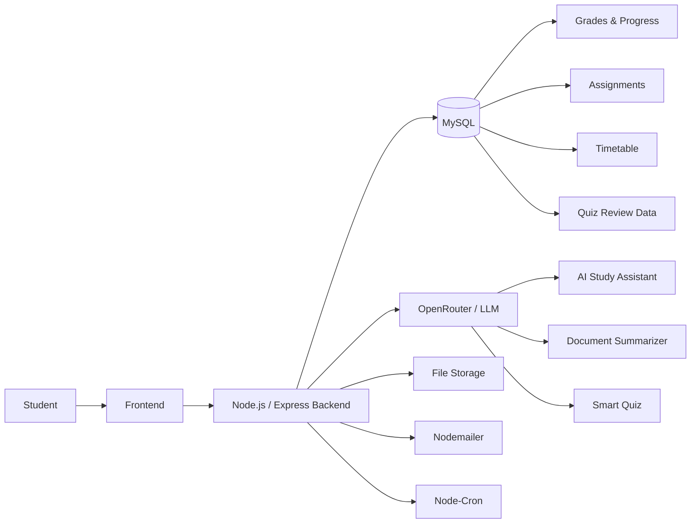

# Self Study

An AI-powered full-stack student learning platform for managing study materials, academic schedules, assignments, grades, progress, and AI-assisted learning.

## Overview

Self Study is a web-based learning platform that brings academic management and AI-powered study tools into a single application.

The platform combines a JavaScript frontend with a Node.js/Express backend and MySQL database. It integrates large language models for conversational study assistance, document summarization, and quiz generation, while also providing academic tracking and automated notification features.

## Features

### Study Material Management

* Upload and manage study materials
* Organize materials by category
* Support for academic documents and media files
* Backend file-upload handling and storage

### Academic Management

* Weekly timetable management
* Assignment and deadline tracking
* Assignment completion tracking
* Grade recording by subject, exam, and slot
* Class-average comparison
* Academic performance and progress visualization

### Automated Notifications

* Scheduled assignment reminders
* Timetable-based notifications
* Email notifications using Nodemailer
* Scheduled background tasks using Node-Cron

### Smart Quiz

* Generate multiple-choice questions from study material using an LLM
* Store generated questions for subsequent review
* Track answers and performance
* Support topic-based quiz generation
* Review questions that are due for revision
* Spaced-repetition scheduling based on consecutive correct answers

The review schedule uses progressively increasing intervals:

`1 → 3 → 7 → 16 → 30 days`

Incorrectly answered questions are brought back for earlier review.

## AI Components

### AI Study Assistant

The platform provides a conversational AI study assistant powered through OpenRouter using the OpenAI SDK.

The assistant maintains recent conversation history to support follow-up questions and is configured to provide academic assistance across general computer science topics as well as robotics, ROS, embedded systems, and automation.

### Document Summarization

The summarization system supports both direct text input and uploaded documents.

Supported document formats include:

* PDF
* PPTX
* DOCX

Long documents are processed using a chunk-based summarization pipeline. The document is divided into smaller sections, each section is summarized individually, and the resulting summaries are combined into a final summary.

Users can also select the desired summary length and tone.

### AI Quiz Generation

The Smart Quiz module uses an LLM to generate multiple-choice questions from provided study material.

Generated questions are validated, stored in the database, and incorporated into the user's review queue. The system combines newly generated questions with questions that are due for review.

## Technical Architecture



The frontend communicates with the Express backend through REST-style API endpoints. The backend handles database operations, file processing, AI requests, scheduled tasks, and email notifications.

## Tech Stack

### Frontend

* HTML5
* CSS3
* JavaScript
* Chart.js

### Backend

* Node.js
* Express.js
* CommonJS
* MySQL2
* REST APIs

### AI and Document Processing

* OpenAI SDK
* OpenRouter
* OfficeParser

### File Handling and Services

* Multer
* Nodemailer
* Node-Cron
* CORS
* dotenv

### Database

* MySQL
* Relational data management
* SQL migrations

## Project Structure

```text
self-study-platform/
│
├── backend/
│   ├── config/
│   │   ├── db.js
│   │   └── multer.js
│   │
│   ├── controllers/
│   │   ├── authController.js
│   │   └── materialController.js
│   │
│   ├── routes/
│   │   ├── auth.js
│   │   └── materials.js
│   │
│   ├── migration_features_update.sql
│   ├── migration_timetable_fix.sql
│   ├── server.js
│   ├── package.json
│   └── .env.example
│
├── frontend/
│   ├── index.html
│   ├── login.html
│   ├── materials.html
│   ├── chatbot.html
│   ├── summariser.html
│   ├── smartquiz.html
│   ├── timetable.html
│   ├── assignments.html
│   ├── grades.html
│   ├── progress.html
│   ├── config.js
│   ├── script.js
│   └── style.css
│
├── .gitignore
└── DEPLOYMENT.md
```

## Database

The application uses MySQL as its relational database.

The database stores information required for:

* User accounts
* Study materials
* Assignments
* Grades
* Timetable data
* Quiz questions
* Quiz review schedules

Database changes are maintained through SQL migration files:

```text
backend/migration_features_update.sql
backend/migration_timetable_fix.sql
```

The quiz system stores question-level review information, including consecutive correct-answer streaks and the next scheduled review time.

## Getting Started

### Prerequisites

Install the following before running the project:

* Node.js
* npm
* MySQL

An API key for the configured LLM provider is also required for the AI features.

### 1. Clone the repository

```bash
git clone https://github.com/keerthanasaravanan266/self-study-platform.git
cd self-study-platform
```

### 2. Install backend dependencies

```bash
cd backend
npm install
```

### 3. Configure environment variables

Create a `.env` file inside the `backend` directory using `.env.example` as the template.

Configure the required database, AI, email, and frontend-origin variables.

### 4. Configure MySQL

Create the required MySQL database and apply the SQL migration files from the `backend` directory.

Update the database connection values in `.env`.

### 5. Start the backend

```bash
npm start
```

The backend runs on:

```text
http://localhost:5000
```

### 6. Run the frontend

Serve the `frontend` directory using a local web server such as VS Code Live Server.

Open:

```text
frontend/login.html
```

The frontend configuration automatically uses the local backend when accessed from `localhost`.

## Environment Variables

The backend uses environment variables for configuration and credentials.

Create:

```text
backend/.env
```

using:

```text
backend/.env.example
```

as the template.

The configuration includes:

```text
DB_HOST
DB_USER
DB_PASSWORD
DB_NAME
DB_PORT

OPENROUTER_API_KEY

EMAIL_USER
EMAIL_PASS

FRONTEND_URL
```

Sensitive values should remain in the local `.env` file and must not be committed to the repository.

## API Overview

The backend exposes endpoints for authentication, study materials, AI features, quizzes, timetable management, assignments, and grades.

| Method | Endpoint                   | Purpose                                           |
| ------ | -------------------------- | ------------------------------------------------- |
| `POST` | `/api/auth/register`       | Register a user                                   |
| `POST` | `/api/auth/login`          | Authenticate a user                               |
| `POST` | `/api/materials/upload`    | Upload study material                             |
| `GET`  | `/api/materials/:userId`   | Retrieve a user's materials                       |
| `POST` | `/api/chat`                | Send a message to the AI study assistant          |
| `POST` | `/api/summarize`           | Summarize text using the AI service               |
| `POST` | `/api/summarize/file`      | Extract and summarize a supported document        |
| `POST` | `/api/quiz`                | Generate or retrieve quiz questions               |
| `POST` | `/api/quiz/answer`         | Submit a quiz answer and update review scheduling |
| `POST` | `/api/timetable/upload`    | Save a timetable image                            |
| `POST` | `/api/timetable/day`       | Save timetable day information                    |
| `GET`  | `/api/timetable/:userId`   | Retrieve timetable information                    |
| `POST` | `/api/assignments`         | Create an assignment                              |
| `GET`  | `/api/assignments/:userId` | Retrieve assignments                              |
| `PUT`  | `/api/assignments/:id`     | Mark an assignment as completed                   |
| `POST` | `/api/grades`              | Add a grade record                                |
| `GET`  | `/api/grades/:userId`      | Retrieve grade records                            |
| `PUT`  | `/api/grades/:id`          | Update a grade record                             |

## Project Status

Self Study is a completed academic project demonstrating the integration of full-stack web development, relational database management, document processing, scheduled backend tasks, and LLM-powered learning features into a unified student platform.
